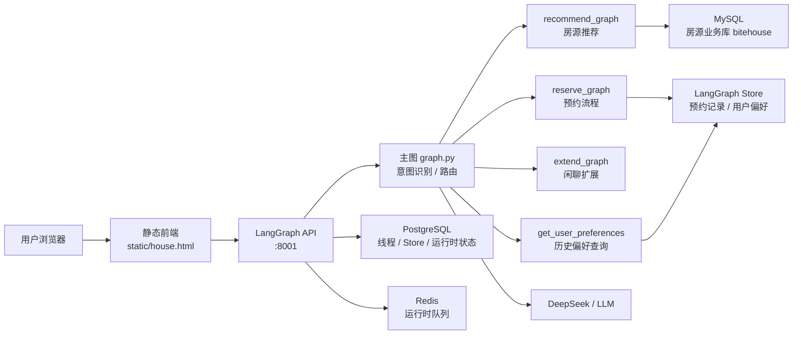

# House Agent

基于 LangGraph 的租房智能助手。项目对外是一个统一聊天入口，对内通过主图路由到多个业务子图，完成房源推荐、预约房源、历史偏好查询和闲聊扩展。

这个项目重点不是简单调用大模型回答问题，而是把租房业务拆成可控的 Agent 工作流：主图负责意图识别和路由，子图负责具体业务流程，状态由 LangGraph 统一管理。

## 功能亮点

- 自然语言找房：用户可以直接输入城市、预算、户型、区域、通勤等需求。
- 多轮信息补全：缺少城市或预算时，通过 LangGraph `interrupt` 暂停流程，等待用户补充后继续同一条工作流。
- SQL 房源检索：模型根据用户需求生成 SQL 查询，从真实 MySQL 房源库中检索数据。
- 推荐结果总结：把数据库结果整理成可读的推荐理由，而不是直接把表格结果丢给用户。
- 预约流程：用户确认预约后，继续收集房源名称、手机号、身份证号，并生成预约记录。
- 历史偏好复用：通过 LangGraph Store 保存用户预算偏好和预约记录，支持后续查询和推荐参考。
- 前端演示页：`static/house.html` 提供可直接演示的聊天界面，支持多对话、新建对话、删除对话和流式输出。
- Docker Compose 部署：后端、前端、LangGraph Postgres、Redis 可一键启动；业务 MySQL 独立连接。

## 技术栈

- Python 3.11+
- LangGraph / LangGraph CLI
- LangChain
- DeepSeek Chat Model
- MySQL：房源业务数据
- PostgreSQL：LangGraph 运行时状态、线程和 Store 持久化
- Redis：LangGraph 运行时队列
- Nginx：前端静态页面服务
- Docker Compose：云服务器部署

## 系统架构



核心文件：

```text
src/agent/graph.py              主图：意图识别和子图路由
src/agent/recommend.py          推荐子图流程
src/agent/reserve.py            预约子图流程
src/agent/extend.py             闲聊/扩展子图
src/agent/node/main.py          主图节点
src/agent/node/recommend.py     推荐节点：信息抽取、SQL 查询、推荐生成
src/agent/node/reserve.py       预约节点：字段收集、房源校验、预约工单生成
src/agent/state/*.py            LangGraph 状态定义
static/house.html               前端演示页面
```

## 核心流程

### 1. 房源推荐

用户输入租房需求后，主图将请求路由到 `recommend_graph`：

1. 抽取城市、预算、区域、户型、朝向、推荐数量等字段。
2. 如果缺少关键字段，通过 `interrupt` 追问用户。
3. 信息完整后生成 SQL 查询。
4. 调用数据库工具查询 MySQL 房源库。
5. 将查询结果整理成自然语言推荐。
6. 推荐完成后询问用户是否需要预约。

### 2. 预约房源

当用户回复“需要预约”后，主图进入 `reserve_graph`：

1. 校验用户要预约的房源是否来自当前会话推荐结果。
2. 收集手机号、身份证号等必要信息。
3. 信息缺失时通过 `interrupt` 逐项追问。
4. 生成预约工单。
5. 清空本轮预约状态，避免重复下单。

### 3. 历史偏好查询

用户询问“我之前预约过哪些房子”“我的预算偏好是多少”时，主图路由到 `get_user_preferences`，从 LangGraph Store 中读取预算偏好和预约记录，并组织回答。

## 本地运行

### 1. 创建环境

```bash
python -m venv .venv
```

Windows PowerShell：

```powershell
.\.venv\Scripts\Activate.ps1
```

Linux / macOS：

```bash
source .venv/bin/activate
```

### 2. 安装依赖

```bash
pip install -U pip
pip install -e .
pip install -U "langgraph-cli[inmem]"
```

### 3. 配置环境变量

```bash
cp .env.example .env
```

按实际情况填写：

```env
DEEPSEEK_API_KEY=your_deepseek_api_key

DB_DIALECT=mysql+pymysql
DB_HOST=your_mysql_host
DB_PORT=3308
DB_NAME=bitehouse
DB_USER=root
DB_PASSWORD=your_mysql_password

POSTGRES_DB=house_agent
POSTGRES_USER=house_agent
POSTGRES_PASSWORD=your_postgres_password
```

`.env` 包含密钥和数据库密码，不要提交到 GitHub。

### 4. 启动后端

```bash
python -m langgraph_cli dev --host 0.0.0.0 --port 8001 --no-browser --allow-blocking
```

后端文档：

```text
http://127.0.0.1:8001/docs
```

### 5. 启动前端

另开一个终端：

```bash
python -m http.server 5500
```

访问页面：

```text
http://127.0.0.1:5500/static/house.html
```

## Docker Compose 部署

部署包包含：

- `house-backend`：LangGraph 后端，端口 `8001`
- `house-frontend`：Nginx 前端，端口 `5500`
- `house-postgres`：LangGraph 状态和 Store 持久化，宿主机端口 `5433`
- `house-redis`：LangGraph 队列，宿主机端口 `6380`

部署步骤：

```bash
cp .env.example .env
nano .env
bash deploy.sh
```

访问地址：

```text
前端：http://服务器IP:5500/static/house.html
后端：http://服务器IP:8001/docs
```

更多说明见 [DEPLOY.md](DEPLOY.md)。

## 已解决的关键问题

- 修复推荐链路中意图识别和信息抽取不稳定的问题。
- 修复“给我推荐房子”没有进入 SQL 查询链路的问题。
- 修复用户补充城市/预算后状态丢失的问题。
- 修复用户回复“需要”后无法继续预约的问题。
- 修复 `interrupt` 对象被前端渲染成 `[object Object]` 的问题。
- 修复推荐结果被“是否预约”提示覆盖的问题。
- 修复推荐内容重复输出多遍的问题。
- 修复预约状态残留导致重复下单的问题。
- 修复可以预约未推荐过房源的问题。
- 修复前端重复创建 thread，导致 `resume` 发到错误会话的问题。
- 增加类似 DeepSeek 的多对话列表，支持新建对话和删除对话。

## 项目设计亮点

- 这是“单入口、多子图编排”的 Agent 系统，而不是一个简单聊天机器人。
- 主图只负责意图识别和路由，推荐、预约、查询、闲聊拆成独立子图，职责清晰。
- 使用 LangGraph State 管理多轮对话中的城市、预算、预约字段和用户历史偏好。
- 使用 `interrupt / command.resume` 实现表单式信息补全。
- 推荐结果来自数据库查询，模型负责生成 SQL 和总结推荐理由，不是凭空编造房源。
- 前端处理了流式输出、工具调用过程、预约追问、多对话管理等真实工程问题。

## 注意事项

- 当前部署方式适合课程项目展示和个人作品集演示，不建议直接作为生产服务长期裸露公网。
- 云服务器开放 `5500`、`8001`、`5433`、`6380` 时，建议结合安全组限制来源 IP。
- `.env`、日志、压缩包、虚拟环境、IDE 配置都已通过 `.gitignore` 排除。
